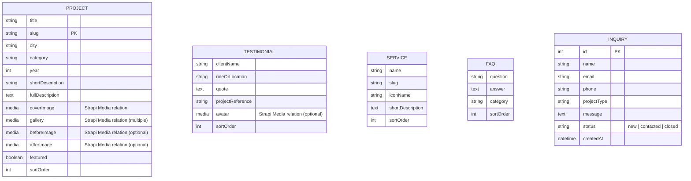
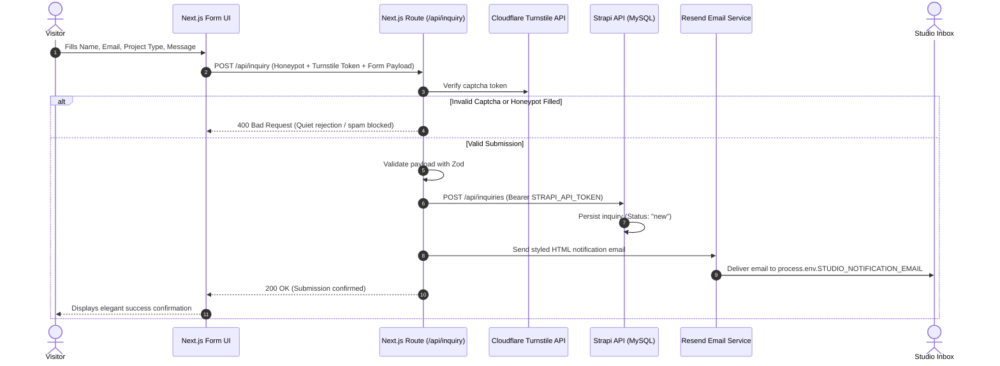

# Inovador Design Studio — Architecture & Implementation Plan

## Executive Summary & Architectural Evaluation

This document defines the complete architectural blueprint and engineering plan for **Inovador Design Studio**, a premium editorial architecture/interior design studio website. 

As Lead Software Architect and Senior Full-Stack Developer, all specifications across `PRD.md`, `Architecture.md`, `Design.md`, and `Phases.md` have been reviewed and refined.

---

## 0. Key Architectural Corrections & Clarifications

1. **Placeholder Integrity & Server-Only Tokens**: No production credentials, email addresses, domains, or health endpoints are assumed or hardcoded. All Strapi API tokens (`STRAPI_READ_TOKEN`, `STRAPI_WRITE_TOKEN`) are strictly server-side environment variables, never prefixed with `NEXT_PUBLIC_`, and never exposed to browser components. The write token is used exclusively by server-side routes for the inquiry workflow.
2. **Next.js Versioning & Vercel Deployment**: The project will utilize the current stable Next.js release compatible with core dependencies (`react`, `framer-motion`, `swiper`) at initialization time. The application is deployed to **Vercel** via the Next.js App Router, using Node or Edge runtime on individual routes only where technically appropriate.
3. **Core Web Vitals Targets**: The architecture provides a strong foundation for SEO and Core Web Vitals performance, targeting:
   - **LCP (Largest Contentful Paint)**: $\le 2.5\text{s}$
   - **CLS (Cumulative Layout Shift)**: $\le 0.1$
   - **INP (Interaction to Next Paint)**: $\le 200\text{ms}$
   *(Performance will be validated through actual Lighthouse and Core Web Vitals browser testing rather than assumed).*
4. **Serverless Spam Protection & Inquiries**: For V1 serverless deployment, inquiries flow through a single Next.js route (`/api/inquiry`) utilizing Cloudflare Turnstile + Honeypot + server-side Zod validation. A shared distributed rate limiter (e.g., Upstash Redis) will be recommended only if high-volume spam requires it.
5. **Unified Inquiry Workflow**: The Next.js `/api/inquiry` route is the single orchestration point responsible for:
   - Input validation (Zod)
   - Spam verification (Turnstile + Honeypot)
   - Persisting the inquiry record to Strapi
   - Triggering the notification email via Resend
   *(Strapi `afterCreate` hooks will NOT duplicate email sending).*
6. **Native Strapi Media Relations**: Project galleries will use Strapi's native Media Library relations (`files` relation) rather than custom JSON string arrays.
7. **Scoped Content Modeling**: V1 avoids unnecessary complexity such as Strapi Dynamic Zones, sticking to clean, robust, structured Content Types.
8. **Modern Font Management**: Typography will be loaded via `next/font` (e.g. `next/font/google` for Fraunces and Inter) for optimal zero-layout-shift font rendering.
9. **Media Provider Configuration**: Cloudinary integration will be handled through the official `@strapi/provider-upload-cloudinary` package with explicit configuration in Phase 2.
10. **Strict Phase 1 Isolation**: Phase 1 is 100% independent of MySQL, Strapi, Resend, Cloudinary, and authentication, operating entirely on local mock data and static assets.
11. **API Abstraction Layer**: Data retrieval is wrapped in `lib/api/` returning domain types, ensuring Phase 1 mock data can be swapped for Phase 2 Strapi REST API calls with zero modifications to UI components.
12. **Clean Static Caching Model**: The data architecture follows `Strapi → Next.js build/ISR → cached/static page → visitor`, ensuring visitors never depend on a live Strapi request for every page view without unnecessary runtime fallback complexity.
13. **Root Repository Documentation**: All core specifications and this plan remain at the project root (`AGENTS.md`, `PRD.md`, `Architecture.md`, `Design.md`, `Phases.md`, `implementation_plan.md`).

---

## Stack Comparison: Option A vs. Option B

### Option A: React (Vite / SPA) + Express + MySQL + Custom Admin Panel
- **Architecture**: Single Page Application (React) + REST API (Express.js) + Hand-rolled React Admin UI + MySQL.
- **Pros**: Complete familiarity for a developer comfortable with Express, React, and MySQL; full control over custom SQL queries.
- **Cons**:
  1. **High Admin Panel Overhead**: A solo developer must spend 3–4 weeks writing authentication, session handling, password resets, role permissions, media upload drag-and-drop, rich text editors, and responsive admin UI from scratch.
  2. **Poor SEO Out of the Box**: React client-rendered SPAs require complex custom SSR or prerendering infrastructure to deliver indexable HTML to search engines.
  3. **Long-Term Maintenance Burden**: Every future request ("add a badge", "reorder project photos") requires custom database migrations and admin UI adjustments by the developer.

### Option B: Next.js + Strapi + MySQL (RECOMMENDED)
- **Architecture**: Hybrid Static/ISR Next.js Frontend + Headless Strapi CMS + Cloudinary Media + MySQL.
- **Pros**:
  1. **Instant CMS with Zero Admin Coding**: Strapi provides a production-grade, secure, multi-role admin dashboard with media asset library, image cropping, rich text, and draft/publish workflows out of the box.
  2. **Editorial SEO & Performance**: Next.js App Router pre-renders HTML at build time, yielding perfect Core Web Vitals, instant LCP, and fully populated OpenGraph/Schema markup.
  3. **Edge Decoupling**: If Strapi or MySQL undergoes maintenance or sleeps, the public marketing site remains 100% online at Vercel Edge.
  4. **Smooth Developer Experience**: Frontend uses standard React/JavaScript/CSS. Data is consumed via standard `fetch` REST calls through a clean `lib/api/` abstraction.

> [!IMPORTANT]
> **Architectural Recommendation**: **Option B (Next.js + Strapi + MySQL)** is strongly recommended. It eliminates weeks of custom admin panel development, provides the studio with an intuitive self-service CMS, and guarantees optimal SEO and Core Web Vitals performance.

---

## 1. Final Recommended Architecture

```
[ Visitor Browser ]
         │
         ▼
[ Next.js App Router (Vercel Edge) ]
   ├── SSG / ISR Static Pages (Home, About, Project Details)
   ├── Client Interactivity (Swiper Carousels, Framer Motion, Category Filters)
   └── API Route (`/api/inquiry` - Honeypot + Turnstile + Zod Validation)
         │                               │
         │ (Private API Token)           │ (Email Dispatch)
         ▼                               ▼
[ Strapi CMS (Railway / Render) ]    [ Resend API ] ──► [ Studio Inbox ]
   ├── Content Types & RBAC Auth         
   ├── Webhooks (On Publish ──► Next.js Revalidate Tag)
   └── Media Library (@strapi/provider-upload-cloudinary)
         │                   │
         ▼                   ▼
  [ MySQL DB ]     [ Cloudinary CDN ]
```

---

## 2. Final Folder Structure

```text
ids/
├── AGENTS.md                     # Engineering & agent rules
├── PRD.md                        # Product requirements
├── Architecture.md               # Technical architecture specification
├── Design.md                     # Design & motion specification
├── Phases.md                     # Phased delivery plan
├── implementation_plan.md        # Comprehensive implementation plan (this file)
│
├── frontend/                     # Next.js Application
│   ├── public/
│   │   ├── icons/               # Studio SVG icons (architecture, interior, landscape)
│   │   └── images/              # Static placeholders & fallback assets
│   ├── src/
│   │   ├── app/
│   │   │   ├── layout.tsx       # Root layout (next/font Fraunces & Inter, SEO meta)
│   │   │   ├── page.tsx         # Editorial Homepage (composed sections)
│   │   │   ├── about/
│   │   │   │   └── page.tsx     # Dedicated About Page
│   │   │   ├── projects/
│   │   │   │   └── [slug]/
│   │   │   │       └── page.tsx # Individual Project Detail View
│   │   │   ├── api/
│   │   │   │   ├── inquiry/
│   │   │   │   │   └── route.ts # Unified Inquiry Handler (Zod + Turnstile + Strapi + Resend)
│   │   │   │   └── revalidate/
│   │   │   │       └── route.ts # On-demand ISR Webhook Listener
│   │   │   ├── sitemap.ts       # Dynamic SEO Sitemap
│   │   │   ├── robots.ts        # Dynamic Robots.txt
│   │   │   └── not-found.tsx    # Custom editorial 404 page
│   │   ├── components/
│   │   │   ├── layout/          # Header, MobileNav, Footer, Container
│   │   │   ├── hero/            # HeroSlider (Swiper + Framer Motion caption reveals)
│   │   │   ├── projects/        # FeaturedProjects, ProjectFilter, ProjectCard, ProjectGallery
│   │   │   ├── about/           # AboutTeaser, StudioStats, Philosophy
│   │   │   ├── process/         # ProcessGrid (4-step numbered architectural walkthrough)
│   │   │   ├── services/        # ServicesGrid, ServiceCard
│   │   │   ├── before-after/    # BeforeAfterSlider (Conditional renovation comparison)
│   │   │   ├── testimonials/    # TestimonialsCarousel (Serif typography)
│   │   │   ├── awards/          # PressAwardsStrip (Conditional grayscale-to-color logo row)
│   │   │   ├── faq/             # FAQAccordion (Accessible ARIA accordion)
│   │   │   ├── contact/         # InquiryForm, ContactDetails
│   │   │   └── ui/              # Button, Input, Textarea, Badge, SectionHeading
│   │   ├── lib/
│   │   │   ├── api/             # Abstracted API client (mock data in Phase 1, Strapi in Phase 2)
│   │   │   │   ├── client.ts    # Fetch wrapper with error handling
│   │   │   │   ├── projects.ts  # getProjects(), getProjectBySlug()
│   │   │   │   ├── services.ts  # getServices()
│   │   │   │   ├── reviews.ts   # getTestimonials()
│   │   │   │   └── faq.ts       # getFAQs()
│   │   │   ├── utils/           # cn(), formatters, animation variants
│   │   │   └── constants/       # Brand tokens, navigation links, meta defaults
│   │   ├── data/                # Local mock JSON data (Phase 1 validation)
│   │   │   ├── projects.json
│   │   │   ├── services.json
│   │   │   ├── testimonials.json
│   │   │   ├── process.json
│   │   │   └── faq.json
│   │   ├── styles/
│   │   │   ├── globals.css      # Design tokens (colors, clamp type scale, grid)
│   │   │   └── typography.css   # Editorial typography classes
│   │   └── types/               # TypeScript interfaces matching Content Model
│   │       └── index.ts
│   ├── .env.example
│   ├── next.config.mjs
│   ├── package.json
│   └── tsconfig.json
│
└── backend/                      # Strapi CMS (Configured in Phase 2)
    ├── config/                  # Database, plugins (Cloudinary, email), middlewares
    ├── src/
    │   ├── api/
    │   │   ├── project/         # Project Content Type
    │   │   ├── testimonial/     # Testimonials Content Type
    │   │   ├── service/         # Services Content Type
    │   │   ├── faq/             # FAQ Content Type
    │   │   └── inquiry/         # Inquiry Content Type
    └── .env.example
```

---

## 3. Frontend Architecture

- **Next.js App Router**: Server Components by default for zero client JS overhead on static content and structural sections.
- **Client Components (`'use client'`)**: Isolated strictly to interactive leaves:
  - `HeroSlider.tsx` (Swiper pagination, slide transitions)
  - `ProjectFilter.tsx` (Instant client-side filter state with Framer Motion `layout` and `AnimatePresence`)
  - `BeforeAfterSlider.tsx` (Touch/drag clip-path divider)
  - `FAQAccordion.tsx` (Keyboard accessible accordion state)
  - `InquiryForm.tsx` (Form state, client validation, Turnstile widget, submit feedback)
  - `MobileNav.tsx` (Off-canvas drawer with smooth ease)
- **Data Hydration & Decoupling**:
  - `lib/api/` layer wraps all data retrieval. In **Phase 1**, it reads from `/src/data/*.json`. In **Phase 2**, the exact same function signatures query Strapi via REST. UI components remain completely agnostic to the underlying data source.

---

## 4. CMS Architecture (Strapi)

- **Role-Based Access Control (RBAC)**:
  - **Super Admin**: Developer maintenance.
  - **Studio Editor**: Non-technical studio staff. Can create, edit, reorder, and publish Projects, Testimonials, FAQs, Services, and view Inquiries. Cannot modify schemas or system settings.
- **Content Draft & Publish**: Studio staff can draft upcoming projects with full image galleries and publish only when photography is ready.
- **Media Library**: Native media management with Cloudinary provider (`@strapi/provider-upload-cloudinary`) for cloud uploads and transformations.
- **Webhooks**: `entry.publish`, `entry.update`, `entry.delete` trigger a POST request to Next.js `/api/revalidate` with a secret bearer token to refresh static ISR caches on demand.

---

## 5. Database & Content Model

### Entity Relational Model



---

## 6. API Strategy

- **Domain-Abstracted API Layer**:
  - Components call domain functions like `getProjects()`, `getProjectBySlug(slug)`, `getServices()`, `getTestimonials()`, `getFAQs()`.
  - In **Phase 1**, these return mock data from local JSON files.
  - In **Phase 2**, these execute native `fetch` requests to Strapi REST endpoints with Next.js cache tags (`next: { tags: ['projects'] }`).
- **REST Endpoints (Phase 2)**:
  - `GET /api/projects?populate=*&sort=sortOrder:asc`
  - `GET /api/projects?filters[slug][$eq]={slug}&populate=*`
  - `GET /api/testimonials?populate=*&sort=sortOrder:asc`
  - `GET /api/services?sort=sortOrder:asc`
  - `GET /api/faqs?sort=sortOrder:asc`
  - `POST /api/inquiries` (dispatched server-to-server from `/api/inquiry`)
- **Resilience**: If the CMS is unreachable, Next.js serves the cached static page without rendering broken UI.

---

## 7. Image & Media Strategy

- **Editorial Photography Rules**:
  - Consistent aspect ratios: `16:10` or `4:3` for project grid cards, `16:9` or `21:9` for Hero slides, `1:1` for detail vignettes.
  - Before/After renovation slider images strictly require identical framing/dimensions.
- **Pipeline**:
  - **Phase 1**: High-quality local/mock architectural photography stored in `public/images/` or direct remote image URLs.
  - **Phase 2**: Uploaded via Strapi Media Library $\rightarrow$ configured via `@strapi/provider-upload-cloudinary`.
  - Next.js `<Image>` component configured with responsive `sizes="(max-width: 768px) 100vw, (max-width: 1200px) 50vw, 33vw"` and WebP/AVIF output.

---

## 8. Authentication Strategy

- **Public Website**: 100% public, zero user login or tracking cookies required.
- **Admin Studio Management**: Strapi's built-in JWT authentication with salted hashing (bcrypt) and session timeouts.
- **API Access**: Protected with granular Strapi API tokens (Read-only token for public content fetching; Write token for server-side inquiry dispatch).

---

## 9. Inquiry / Contact Workflow



---

## 10. SEO Strategy

1. **Semantic Hierarchy**: Single `<h1>` per page with editorial typography, logical `<h2>` and `<h3>` heading structure.
2. **Metadata & Open Graph**: Dynamic metadata generation in Next.js (`generateMetadata`) providing custom titles, descriptions, and high-res OG image previews for every project.
3. **Structured Data (JSON-LD)**:
   - `LocalBusiness` / `ProfessionalService` schema (Studio name, geo-coordinates, address, service catalog).
   - `VisualArtwork` / `CreativeWork` schema on Project Detail pages.
4. **Sitemap & Robots**: Next.js native `sitemap.ts` dynamically fetches all active project slugs and generates a standard XML sitemap.
5. **Target Search Intent**: Keyword optimization for `"architecture studio [City]"`, `"interior design [City]"`, `"luxury residential renovation"`.

---

## 11. Performance Strategy

- **Core Web Vitals Production Targets**:
  - **LCP (Largest Contentful Paint)**: $\le 2.5\text{s}$ (Hero priority image preloaded with `priority` attribute).
  - **CLS (Cumulative Layout Shift)**: $\le 0.1$ (Explicit aspect ratios on all image containers and skeleton placeholders).
  - **INP (Interaction to Next Paint)**: $\le 200\text{ms}$ (Lean client JavaScript; isolated interactive components).
- **Typography Performance**: Managed through `next/font/google` with `display: 'swap'` and automatic font subsetting.
- **Bundle Optimization**: Individual Swiper module imports (e.g. `Navigation, Autoplay, EffectFade` only) and lightweight SVGs.

---

## 12. Accessibility Strategy (WCAG 2.1 AA)

- **Color Contrast**: Contrast ratio $\ge 4.5:1$ for body text (`#1A1A1A` on `#F4F1EC` / `#FFFFFF`) and $\ge 3:1$ for large display headers and buttons.
- **Keyboard Navigation**:
  - All carousels (Hero, Testimonials) support Left/Right arrow key navigation and clear visible focus rings.
  - Accordion components utilize native `<button>` triggers with `aria-expanded` and `aria-controls`.
- **Screen Reader Announcements**: Form error messages linked via `aria-describedby`; descriptive `alt` text required on all portfolio photography.
- **Reduced Motion**: Full support for `prefers-reduced-motion: reduce` across all Framer Motion variants.

---

## 13. Security Considerations

- **Server-Side Validation**: Strict Zod schemas validating all fields before processing.
- **Spam Defense**: Cloudflare Turnstile token validation + hidden Honeypot field.
- **Environment Isolation**: Zero API keys, database credentials, or email tokens exposed in client bundles or committed to Git.
- **Security Headers**: Strict Content Security Policy (CSP), `X-Frame-Options: DENY`, and `X-Content-Type-Options: nosniff` configured in Next.js headers/middleware.

---

## 14. Development Phases (Strict Alignment with Phases.md)

| Phase | Description | Key Deliverables & Boundaries |
|---|---|---|
| **Phase 0** | **Setup & Content Collection** | Repo setup, design tokens (`#111111`, `#F4F1EC`, `#8C877E`, terracotta accent), typography setup via `next/font`, initial mock JSON data. |
| **Phase 1** | **Static Frontend MVP** | Complete Next.js visual experience with all 10 homepage sections + `/about` + `/projects/[slug]`. **100% independent of MySQL, Strapi, Resend, Cloudinary, and auth.** Deployed to Vercel preview for client design sign-off. |
| **Phase 2** | **Backend & CMS (Strapi + MySQL)** | Initialize Strapi, connect MySQL, create Content Types, configure `@strapi/provider-upload-cloudinary`, migrate Phase 1 mock data to real entries. |
| **Phase 3** | **Integration & Polish** | Connect `lib/api` to Strapi REST API, configure ISR revalidation webhooks, connect `/api/inquiry` route with Turnstile + Resend, run accessibility and performance audits. |
| **Phase 4** | **Handover & Client Training** | Studio admin walkthrough guide, automated database backup verification, uptime monitoring setup. |
| **Phase 5** | **Launch & Post-Launch** | Production DNS cutover, SSL verification, and post-launch monitoring. |

---

## 15. Testing & Quality Assurance Strategy

1. **Linting & Type Safety**: `tsc --noEmit` and ESLint zero-warning policy on all pull requests.
2. **Component & Flow Verification**:
   - Filter state verification: Testing combination of City + Category filters and empty states.
   - Form submission lifecycle: Testing valid inputs, invalid emails, empty mandatory fields, and network failures.
   - Responsive breakpoints: Testing mobile ($375\text{px}$), tablet ($768\text{px}$), desktop ($1280\text{px}$), and ultra-wide ($1920\text{px}$).
3. **Automated Audit**: Lighthouse CI audit for Performance, Accessibility, Best Practices, and SEO.

---

## 16. Deployment & Infrastructure Strategy

- **Frontend Hosting**: **Vercel**
  - Continuous deployment from `main` branch.
  - Preview deployments on pull requests for client design approval.
  - Custom domain DNS with automated SSL.
- **CMS / Backend Hosting**: **Railway / Render**
  - Node.js runtime for Strapi CMS.
  - Managed MySQL database with scheduled daily backups.
  - Cloudinary for persistent global media delivery.
- **Monitoring**: Uptime monitoring on `process.env.NEXT_PUBLIC_SITE_URL` and `process.env.STRAPI_URL` to alert on downtime.

---

## Required Environment Variables (`.env.example`)

```bash
# Frontend (.env.local)
NEXT_PUBLIC_SITE_URL="http://localhost:3000"
STRAPI_API_URL="http://localhost:1337"
STRAPI_API_TOKEN="<STRAPI_READ_WRITE_API_TOKEN>"
REVALIDATE_SECRET="<ISR_REVALIDATION_SECRET_KEY>"
CLOUDFLARE_TURNSTILE_SECRET_KEY="<CLOUDFLARE_TURNSTILE_SECRET>"
NEXT_PUBLIC_CLOUDFLARE_TURNSTILE_SITE_KEY="<CLOUDFLARE_TURNSTILE_SITE_KEY>"
RESEND_API_KEY="<RESEND_API_KEY>"
STUDIO_NOTIFICATION_EMAIL="<STUDIO_NOTIFICATION_EMAIL>"

# Backend (Strapi .env)
DATABASE_CLIENT="mysql"
DATABASE_HOST="127.0.0.1"
DATABASE_PORT="3306"
DATABASE_NAME="inovador_cms"
DATABASE_USERNAME="<DB_USER>"
DATABASE_PASSWORD="<DB_PASSWORD>"
CLOUDINARY_NAME="<CLOUDINARY_CLOUD_NAME>"
CLOUDINARY_KEY="<CLOUDINARY_API_KEY>"
CLOUDINARY_SECRET="<CLOUDINARY_API_SECRET>"
ADMIN_JWT_SECRET="<ADMIN_JWT_SECRET>"
API_TOKEN_SALT="<API_TOKEN_SALT>"
APP_KEYS="<APP_KEY_1>,<APP_KEY_2>"
TRANSFER_TOKEN_SALT="<TRANSFER_TOKEN_SALT>"
JWT_SECRET="<JWT_SECRET>"
```
